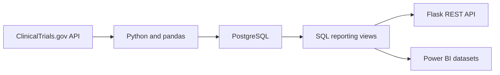

# Clinical Trials Operations & Data Quality Platform

## Project Overview

This end-to-end analytics project uses public study-level data from the ClinicalTrials.gov API to identify incomplete, duplicate, and outdated clinical trial registry records.

The platform extracts and transforms study data with Python, applies automated data-quality rules, stores validated records and issues in PostgreSQL, exposes operational metrics through a Flask REST API, and prepares reporting datasets for Power BI.

No participant-level or protected health information is used.

## Business Questions

- How many clinical studies are currently recruiting?
- Which recruiting studies have outdated registry information?
- How many data-quality issues require review?
- Which studies and sponsors have the greatest number of issues?
- What percentage of studies is affected by open issues?

## Architecture



## Key Results

| Metric | Result |
|---|---:|
| Recruiting studies processed | 100 |
| Total planned enrollment | 407,220 |
| Missing required values | 0 |
| Duplicate NCT IDs | 0 |
| Outdated recruiting studies | 9 |
| High-priority issues | 2 |
| Studies affected by open issues | 9% |

## Data-Quality Rules

| Rule | Description |
|---|---|
| DQ001 | Required fields must not be missing |
| DQ002 | NCT IDs must be unique |
| DQ003 | Recruiting studies not updated within 365 days require review |

Records not updated for more than 730 days receive a `HIGH` priority. Other outdated recruiting records receive a `MEDIUM` priority.

## Technology Stack

- Python and pandas
- ClinicalTrials.gov API
- PostgreSQL and SQL
- Flask REST API
- Psycopg
- Docker
- Power BI
- Git and GitHub

## API Endpoints

| Method | Endpoint | Purpose |
|---|---|---|
| GET | `/health` | Check whether the API is running |
| GET | `/api/quality-overview` | Retrieve executive data-quality KPIs |
| GET | `/api/issues` | Retrieve all data-quality issues |
| GET | `/api/issues?priority=HIGH` | Filter issues by priority |
| GET | `/api/studies/<nct_id>/issues` | Retrieve issues for one clinical study |

### Example response

`GET /api/quality-overview`

```json
{
  "affected_study_percentage": "9.00",
  "high_priority_issues": 2,
  "open_issues": 9,
  "studies_with_open_issues": 9,
  "total_enrollment": 407220,
  "total_studies": 100
}
```

## Repository Structure

- `src/fetch_studies.py` — extracts public study records from the API
- `src/transform_studies.py` — transforms nested JSON into tabular data
- `src/validate_studies.py` — applies data-quality rules and creates issues
- `src/app.py` — provides Flask API endpoints
- `sql/01_create_tables.sql` — creates PostgreSQL tables and constraints
- `sql/02_create_views.sql` — creates KPI and reporting views
- `data/raw/` — stores raw API records
- `data/processed/` — stores transformed study records
- `data/quality/` — stores validation reports and standardized issues
- `data/dashboard/` — stores Power BI-ready reporting datasets

## Running the Python Pipeline

Create and activate a virtual environment, then install dependencies:

```bash
python -m venv .venv
source .venv/bin/activate
python -m pip install -r requirements.txt
```

Run the pipeline:

```bash
python src/fetch_studies.py
python src/transform_studies.py
python src/validate_studies.py
```

## Environment Configuration

Create a local `.env` file in the repository root:

```text
DB_HOST=127.0.0.1
DB_PORT=5432
DB_NAME=clinical_trials
DB_USER=clinical_user
DB_PASSWORD=your_local_database_password
```

The `.env` file is excluded from Git and must never be committed.

## Running the Flask API

Ensure PostgreSQL is running, then start Flask:

```bash
python src/app.py
```

Open:

```text
http://127.0.0.1:5000/health
```

## Data Source

Public study-level data is retrieved from the [ClinicalTrials.gov API](https://clinicaltrials.gov/data-api/about-api).

## Disclaimer

This project is an educational portfolio project. Data-quality flags indicate records requiring operational review and should not be interpreted as regulatory violations or clinical safety conclusions.